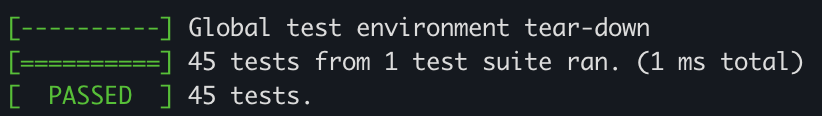
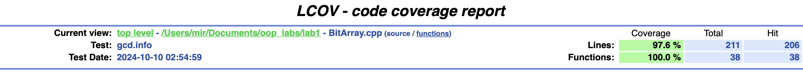
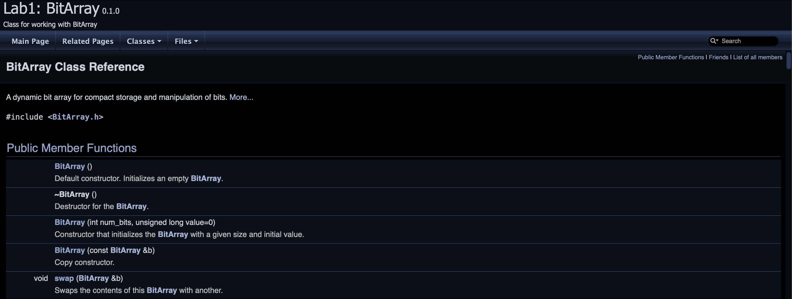

<h1>Lab 1</h1>
<h2>Build project:</h2>
<ul>
    <li>Clone this repositories</li>
    <li>mkdir build</li>
    <li>cd build</li>
    <li>cmake ..</li>
    <li>make</li>
    <li>cd ..</li>
</ul>
<h2>Tests (Do all the previous steps):</h2>
<ul>
    <li>git clone https://github.com/google/googletest.git -b release-1.12.1</li>
    <li>cd googletest</li>
    <li>mkdir build</li>
    <li>cd build</li>
    <li>cmake .. -DBUILD_GMOCK=OFF</li>
    <li>make</li>
    <li>cd ../..</li>
    <li>g++ -std=c++17 lab1_tests.cpp BitArray.cpp googletest/build/lib/libgtest.a googletest/build/lib/libgtest_main.a -lpthread -I googletest/googletest/include && ./a.out</li>
</ul>

<h2>The Test Analyzer (Do all the previous steps, I used lcov and gcov):</h2>
<ul>
    <li>g++ -std=c++17 lab1_tests.cpp BitArray.cpp googletest/build/lib/libgtest.a googletest/build/lib/libgtest_main.a --coverage -lpthread -I googletest/googletest/include && ./a.out -lgtest</li>
    <li>lcov -t "gcd" -o gcd.info -c -d . --ignore-errors inconsistent</li>
    <li>genhtml -o report gcd.info --ignore-errors inconsistent</li>
    <li>Go to report and open index.html , we go into the project and see the coverage</li>
</ul>

<h2>Documentation (I used Doxygen):</h2>
<ul>
    <li>In the BitArray.h file, we write comments in a special way</li>
    <li>I specified the settings in the Doxyfile (you can use mine as a template)</li>
    <li>Write to the terminal: doxygen</li>
    <li>Go to documentation and open index.html</li>
</ul>
